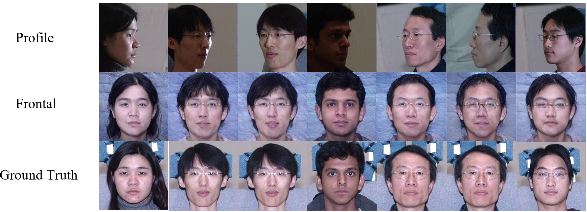
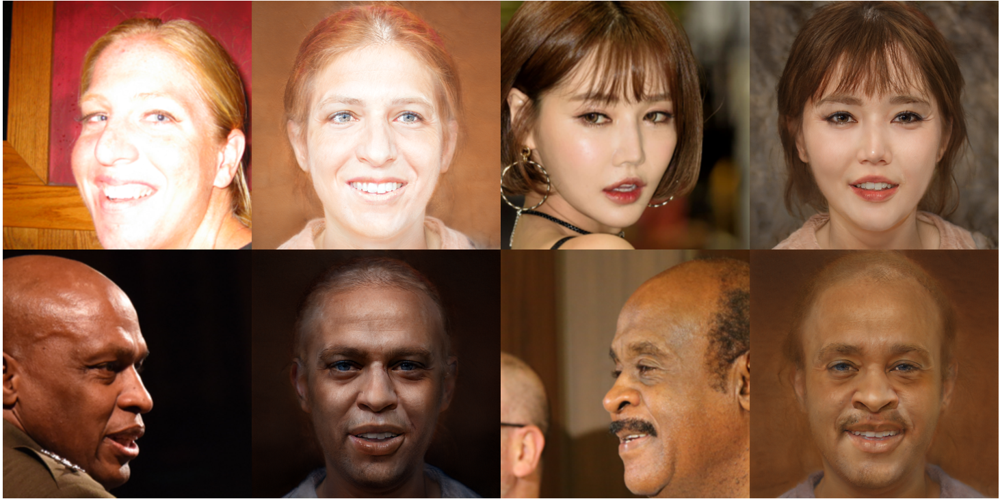

# StyleGAN for Face Frontalization


<p align="center">

<br>
Face Frontalization Results on CMU Multi-PIE Face Dataset
</p>


## Project Overview
This project addresses the challenge of facial identity preservation during face frontalization, leveraging the capabilities of **StyleGAN**. By generating front-facing views from non-frontal facial images while maintaining accurate identity features, this project is particularly beneficial for facial recognition systems, where frontal images yield optimal performance.

The model was trained using the CMU Multi-PIE Face Dataset, which features paired frontal and non-frontal images. Robust data preparation scripts for the CMU Multi-PIE dataset are included in the project.

---

## Dataset
The **CMU Multi-PIE Face Dataset** was utilized for training, offering:
- Multi-view paired facial images for consistent identity mapping.
- Diverse lighting conditions to enhance the model's generalization capability.

Data preparation scripts for the dataset can be found in the `CMU` folder.

---

## Model and Training
Key aspects of the model training include:
- Tailored training strategies using paired frontal and profile face images.
- Loss functions optimized for preserving facial identity features.

The pre-trained weights for the model, `frontalization.pt`, are available for download [here](https://drive.google.com/file/d/10IW2ZFZ8iCkZqTUlTpKhIG8u9SpUeyVk/view?usp=sharing). The processed training data is also accessible [here](https://drive.google.com/your_training_data_link).

---

## Pretrained Models
Please download the pre-trained models from the following links. Each pSp model contains the entire pSp architecture, including the encoder and decoder weights.

| Path | Description |
| :--- | :---------- |
| [StyleGAN Inversion](https://drive.google.com/file/d/1bMTNWkh5LArlaWSc_wa8VKyq2V42T2z0/view?usp=sharing) | pSp trained with the FFHQ dataset for StyleGAN inversion. |
| [Face Frontalization](https://drive.google.com/file/d/1_S4THAzXb-97DbpXmanjHtXRyKxqjARv/view?usp=sharing) | pSp trained with the FFHQ dataset for face frontalization. |

In addition, we provide various auxiliary models needed for training your own pSp model from scratch as well as pretrained models needed for computing the ID metrics reported in the paper.

| Path | Description |
| :--- | :---------- |
| [FFHQ StyleGAN](https://drive.google.com/file/d/1EM87UquaoQmk17Q8d5kYIAHqu0dkYqdT/view?usp=sharing) | StyleGAN model pretrained on FFHQ taken from [rosinality](https://github.com/rosinality/stylegan2-pytorch) with 1024x1024 output resolution. |
| [IR-SE50 Model](https://drive.google.com/file/d/1KW7bjndL3QG3sxBbZxreGHigcCCpsDgn/view?usp=sharing) | Pretrained IR-SE50 model taken from [TreB1eN](https://github.com/TreB1eN/InsightFace_Pytorch) for use in our ID loss during pSp training. |
| [MoCo ResNet-50](https://drive.google.com/file/d/18rLcNGdteX5LwT7sv_F7HWr12HpVEzVe/view?usp=sharing) | Pretrained ResNet-50 model trained using MOCOv2 for computing MoCo-based similarity loss on non-facial domains. The model is taken from the [official implementation](https://github.com/facebookresearch/moco). |
| [CurricularFace Backbone](https://drive.google.com/file/d/1f4IwVa2-Bn9vWLwB-bUwm53U_MlvinAj/view?usp=sharing) | Pretrained CurricularFace model taken from [HuangYG123](https://github.com/HuangYG123/CurricularFace) for use in ID similarity metric computation. |
| [MTCNN](https://drive.google.com/file/d/1tJ7ih-wbCO6zc3JhI_1ZGjmwXKKaPlja/view?usp=sharing) | Weights for MTCNN model taken from [TreB1eN](https://github.com/TreB1eN/InsightFace_Pytorch) for use in ID similarity metric computation. (Unpack the tar.gz to extract the 3 model weights.) |

By default, we assume that all auxiliary models are downloaded and saved to the directory `pretrained_models`. However, you may use your own paths by changing the necessary values in `configs/path_configs.py`.

---

## Installation and Usage

### Prerequisites
- Python 3.7 or higher
- CUDA-compatible GPU
- NVIDIA CUDA and cuDNN

### Installation
1. Clone this repository:
   ```bash
   git clone https://github.com/your-repo/StyleGAN_Face_Frontalization.git
   cd StyleGAN_Face_Frontalization
   ```
2. Set up the Python environment:
   ```bash
   conda env create -f environment/ff_env.yaml
   conda activate ff_env
   ```

### Training
- For a comprehensive list of flags specific to training, refer to `options/train_options.py`.
- For flags specific to testing, see `options/test_options.py`. 
To train the model:
```bash
python scripts/train.py \
   --dataset_type=ffhq_frontalize \
   --exp_dir=/path/to/experiment \
   --workers=8 \
   --batch_size=8 \
   --test_batch_size=8 \
   --test_workers=8 \
   --val_interval=2500 \
   --save_interval=5000 \
   --encoder_type=GradualStyleEncoder \
   --start_from_latent_avg \
   --lpips_lambda=0.08 \
   --l2_lambda=0.001 \
   --lpips_lambda_crop=0.8 \
   --l2_lambda_crop=0.01 \
   --id_lambda=1 \
   --w_norm_lambda=0.005
```

### Inference
Run inference using the pre-trained weights:
```bash
python scripts/inference.py \
  --checkpoint_path=/path/to/frontalization.pt \
  --data_path=/path/to/test_data \
  --test_batch_size=4 \
  --output_path=/path/to/save_outputs
```

---

## Results
Example results of the frontalization task:
<p align="center">

<br>
Face Frontalization in FFHQ test set
</p>

---
## Credits
This project is based on the [pixel2style2pixel (pSp)](https://github.com/eladrich/pixel2style2pixel) framework by Elad Richardson et al., as described in the paper [Encoding in Style: a StyleGAN Encoder for Image-to-Image Translation](https://arxiv.org/abs/2008.00951).

---

## Citation
If you use this repository, please cite both the original pSp paper and this project:

```
@InProceedings{richardson2021encoding,
  author = {Richardson, Elad and others},
  title = {Encoding in Style: a StyleGAN Encoder for Image-to-Image Translation},
  booktitle = {CVPR},
  year = {2021}
}
```

---

## License
This repository is licensed under the MIT License. See `LICENSE` for details.
